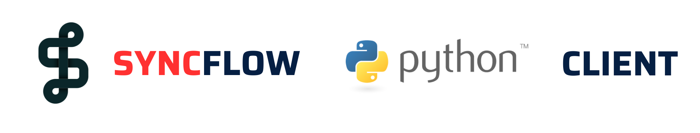

# `SyncFlow` Python Client

<p align="center">
  <a href="https://github.com/oele-isis-vanderbilt/syncflow-python-client.git"></a>
</p>
<p align="center">
    <em>Reusable Python client implementation for SyncFlow.</em>
</p>


This is a reusable Python client implementation for SyncFlow. The idea here is to create necessary functionality to interact with the SyncFlow api, in a Python application. Primary beneficiaries of this package could be clients to SyncFlow, who have their own backend in Python and want to integrate with SyncFlow.

## Features
- Manage sessions, participants and recordings for a syncflow project
- Easy integration with existing Client applications

## Installation
Install the package using pip.

```sh
$ pip install .
```
